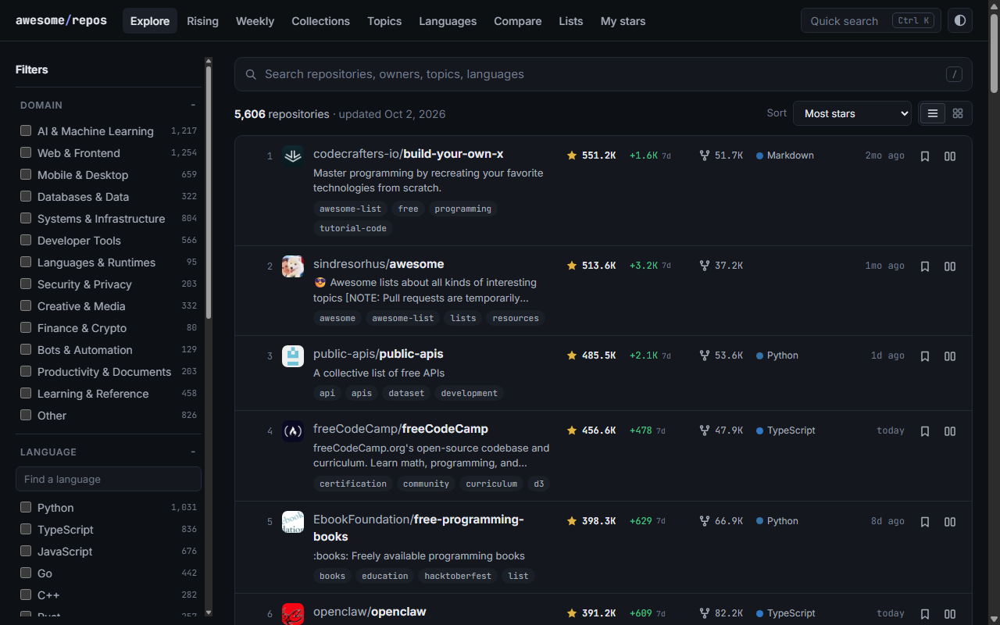

# awesome-github-repos

Every public GitHub repository with 10,000+ stars, in a fast explorer that refreshes itself daily.

<!-- STATS:START -->
**5,607** repositories with 10,000+ stars, as of **2026-10-05**.
<!-- STATS:END -->

**Live site: [joshi595.github.io/awesome-github-repos](https://joshi595.github.io/awesome-github-repos/)**

[](https://github.com/Joshi595/awesome-github-repos/actions/workflows/publish.yml)
[](LICENSE)

[](https://joshi595.github.io/awesome-github-repos/)

## What you can do with it

- **Search and filter** by domain, language, topic, star count, activity and age. Every view has a shareable URL.
- **See what is rising.** The site records star counts daily, so it can show weekly and monthly gainers, new entrants to the 10k club, and rank climbers. A plain star ranking cannot.
- **Read the weekly report.** Each week gets a page with a permanent address (and an RSS feed): top gainers, fastest growers, what joined the list and what left it.
- **Open any repository** for its star history chart, release and issue figures, similar projects and the collections it appears in.
- **Understand a repository in one click.** Each one links to tools that explain it, diagram its architecture, digest it for an AI assistant, or write a prompt to rebuild it.
- **Compare** up to four repositories side by side, with their growth on one chart.
- **Check your stars.** Enter a GitHub username to see which top repositories it has starred, which are rising, and what it might like next.
- **Save shortlists** in your browser, export them as Markdown, and share them with a link. No account.
- **Follow a collection:** short hand-picked sets for a goal, each entry with a note on why it is there.

## Top 100

<!-- TOP:START -->
| # | Repository | Stars | Language | Description |
| ---: | --- | ---: | --- | --- |
| 1 | [codecrafters-io/build-your-own-x](https://github.com/codecrafters-io/build-your-own-x) | 551,657 | Markdown | Master programming by recreating your favorite technologies from scratch. |
| 2 | [sindresorhus/awesome](https://github.com/sindresorhus/awesome) | 514,990 | - | 😎 Awesome lists about all kinds of interesting topics [NOTE: Pull requests are temporarily disabled until I have a chance to catch up with the existing ones] |
| 3 | [public-apis/public-apis](https://github.com/public-apis/public-apis) | 486,215 | Python | A collective list of free APIs |
| 4 | [freeCodeCamp/freeCodeCamp](https://github.com/freeCodeCamp/freeCodeCamp) | 456,788 | TypeScript | freeCodeCamp.org's open-source codebase and curriculum. Learn math, programming, and computer science for free. |
| 5 | [EbookFoundation/free-programming-books](https://github.com/EbookFoundation/free-programming-books) | 398,517 | Python | :books: Freely available programming books |
| 6 | [openclaw/openclaw](https://github.com/openclaw/openclaw) | 391,426 | TypeScript | The AI that really does things. Any OS. Any Platform. The lobster way. 🦞 |
| 7 | [donnemartin/system-design-primer](https://github.com/donnemartin/system-design-primer) | 373,257 | Python | Learn how to design large-scale systems. Prep for the system design interview. Includes Anki flashcards. |
| 8 | [nilbuild/developer-roadmap](https://github.com/nilbuild/developer-roadmap) | 368,926 | TypeScript | Interactive roadmaps, guides and other educational content to help developers grow in their careers. |
| 9 | [jwasham/coding-interview-university](https://github.com/jwasham/coding-interview-university) | 362,376 | - | A complete computer science study plan to become a software engineer. |
| 10 | [vinta/awesome-python](https://github.com/vinta/awesome-python) | 325,328 | Python | The definitive list that answers "I want to do X in Python, which tool should I use?" |
| 11 | [awesome-selfhosted/awesome-selfhosted](https://github.com/awesome-selfhosted/awesome-selfhosted) | 324,037 | - | A list of Free Software network services and web applications which can be hosted on your own servers |
| 12 | [obra/superpowers](https://github.com/obra/superpowers) | 295,518 | Shell | An agentic skills framework & software development methodology that works. |
| 13 | [practical-tutorials/project-based-learning](https://github.com/practical-tutorials/project-based-learning) | 285,899 | Python | Curated list of project-based tutorials |
| 14 | [996icu/996.ICU](https://github.com/996icu/996.ICU) | 277,274 | - | Repo for counting stars and contributing. Press F to pay respect to glorious developers. |
| 15 | [mattpocock/skills](https://github.com/mattpocock/skills) | 276,797 | Shell | Skills for Real Engineers. Straight from my .agents directory. |
| 16 | [affaan-m/ECC](https://github.com/affaan-m/ECC) | 273,378 | JavaScript | The agent harness performance optimization system. Skills, instincts, memory, security, and research-first development for Claude Code, Codex, Opencode, Cursor… |
| 17 | [NousResearch/hermes-agent](https://github.com/NousResearch/hermes-agent) | 251,347 | Python | The agent that grows with you |
| 18 | [torvalds/linux](https://github.com/torvalds/linux) | 251,169 | C | Linux kernel source tree |
| 19 | [react/react](https://github.com/react/react) | 250,904 | JavaScript | The library for web and native user interfaces. |
| 20 | [trimstray/the-book-of-secret-knowledge](https://github.com/trimstray/the-book-of-secret-knowledge) | 248,037 | - | A collection of inspiring lists, manuals, cheatsheets, blogs, hacks, one-liners, cli/web tools and more. |
| 21 | [deepseek-ai/deepseek-harness](https://github.com/deepseek-ai/deepseek-harness) | 243,845 | TypeScript | DeepSeek Harness: Everything is a Plugin. |
| 22 | [TheAlgorithms/Python](https://github.com/TheAlgorithms/Python) | 225,244 | Python | All Algorithms implemented in Python |
| 23 | [multica-ai/andrej-karpathy-skills](https://github.com/multica-ai/andrej-karpathy-skills) | 217,001 | - | A single CLAUDE.md file to improve Claude Code behavior, derived from Andrej Karpathy's observations on LLM coding pitfalls. |
| 24 | [vuejs/vue](https://github.com/vuejs/vue) | 212,828 | TypeScript | This is the repo for Vue 2. For Vue 3, go to https://github.com/vuejs/core |
| 25 | [anomalyco/opencode](https://github.com/anomalyco/opencode) | 211,832 | TypeScript | The open source coding agent. |
| 26 | [ossu/computer-science](https://github.com/ossu/computer-science) | 209,855 | HTML | 🎓 Path to a free self-taught education in Computer Science! |
| 27 | [n8n-io/n8n](https://github.com/n8n-io/n8n) | 206,710 | TypeScript | Fair-code workflow automation platform with native AI capabilities. Combine visual building with custom code, self-host or cloud, 400+ integrations. |
| 28 | [DigitalPlatDev/FreeDomain](https://github.com/DigitalPlatDev/FreeDomain) | 202,666 | Markdown | Free domain registration and practical DNS learning resources for everyone. |
| 29 | [tensorflow/tensorflow](https://github.com/tensorflow/tensorflow) | 200,704 | C++ | An Open Source Machine Learning Framework for Everyone |
| 30 | [trekhleb/javascript-algorithms](https://github.com/trekhleb/javascript-algorithms) | 196,867 | JavaScript | 📝 Algorithms and data structures implemented in JavaScript with explanations and links to further readings |
| 31 | [yt-dlp/yt-dlp](https://github.com/yt-dlp/yt-dlp) | 195,702 | Python | A feature-rich command-line audio/video downloader |
| 32 | [ultraworkers/claw-code](https://github.com/ultraworkers/claw-code) | 195,212 | Rust | An agent-managed museum exhibit, built in Rust with Gajae-Code / LazyCodex — developed and maintained with no human intervention. |
| 33 | [microsoft/vscode](https://github.com/microsoft/vscode) | 193,534 | TypeScript | Visual Studio Code |
| 34 | [massgravel/Microsoft-Activation-Scripts](https://github.com/massgravel/Microsoft-Activation-Scripts) | 193,423 | Batchfile | Open-source Windows and Office activator featuring HWID, Ohook, TSforge, and Online KMS activation methods, along with advanced troubleshooting. |
| 35 | [ohmyzsh/ohmyzsh](https://github.com/ohmyzsh/ohmyzsh) | 190,161 | Shell | 🙃 A delightful community-driven (with 2,500+ contributors) framework for managing your zsh configuration. Includes 300+ optional plugins (rails, git, macOS, h… |
| 36 | [firecrawl/firecrawl](https://github.com/firecrawl/firecrawl) | 188,796 | TypeScript | Supercharge your AI agents with data from the web and beyond. Building the library for superintelligence. 🔥 |
| 37 | [microsoft/markitdown](https://github.com/microsoft/markitdown) | 188,581 | Python | Python tool for converting files and office documents to Markdown. |
| 38 | [Significant-Gravitas/AutoGPT](https://github.com/Significant-Gravitas/AutoGPT) | 187,652 | Python | AutoGPT is the vision of accessible AI for everyone, to use and to build on. Our mission is to provide the tools, so that you can focus on what matters. |
| 39 | [jackfrued/Python-100-Days](https://github.com/jackfrued/Python-100-Days) | 187,086 | Jupyter Notebook | Python - 100天从新手到大师 |
| 40 | [avelino/awesome-go](https://github.com/avelino/awesome-go) | 187,057 | Go | A curated list of awesome Go frameworks, libraries and software |
| 41 | [CyC2018/CS-Notes](https://github.com/CyC2018/CS-Notes) | 186,380 | - | :books: 技术面试必备基础知识、Leetcode、计算机操作系统、计算机网络、系统设计 |
| 42 | [getify/You-Dont-Know-JS](https://github.com/getify/You-Dont-Know-JS) | 185,015 | - | A book series (2 published editions) on the JS language. |
| 43 | [ollama/ollama](https://github.com/ollama/ollama) | 182,230 | Go | Get up and running with Kimi, GLM, MiniMax, DeepSeek, gpt-oss, Qwen, Gemma and other models. |
| 44 | [521xueweihan/HelloGitHub](https://github.com/521xueweihan/HelloGitHub) | 180,254 | Python | :octocat: 分享 GitHub 上有趣、入门级的开源项目。Share interesting, entry-level open source projects on GitHub. |
| 45 | [anthropics/skills](https://github.com/anthropics/skills) | 179,736 | Python | Public repository for Agent Skills |
| 46 | [flutter/flutter](https://github.com/flutter/flutter) | 179,346 | Dart | Flutter makes it easy and fast to build beautiful apps for mobile and beyond |
| 47 | [github/gitignore](https://github.com/github/gitignore) | 176,024 | - | A collection of useful .gitignore templates |
| 48 | [twbs/bootstrap](https://github.com/twbs/bootstrap) | 174,988 | MDX | The most popular HTML, CSS, and JavaScript framework for developing responsive, mobile first projects on the web. |
| 49 | [f/prompts.chat](https://github.com/f/prompts.chat) | 172,070 | HTML | f.k.a. Awesome ChatGPT Prompts. Share, discover, and collect prompts from the community. Free and open source — self-host for your organization with complete p… |
| 50 | [huggingface/transformers](https://github.com/huggingface/transformers) | 166,969 | Python | 🤗 Transformers: the model-definition framework for state-of-the-art machine learning models in text, vision, audio, and multimodal models, for both inference… |
| 51 | [AUTOMATIC1111/stable-diffusion-webui](https://github.com/AUTOMATIC1111/stable-diffusion-webui) | 165,194 | Python | Stable Diffusion web UI |
| 52 | [jlevy/the-art-of-command-line](https://github.com/jlevy/the-art-of-command-line) | 162,577 | - | Master the command line, in one page |
| 53 | [Snailclimb/JavaGuide](https://github.com/Snailclimb/JavaGuide) | 159,031 | JavaScript | Java 面试 & 后端通用面试指南，覆盖计算机基础、数据库、分布式、高并发、系统设计与 AI 应用开发 |
| 54 | [langgenius/dify](https://github.com/langgenius/dify) | 157,876 | TypeScript | Build Agentic workflows, RAG pipelines, with rich AI model and tool support on one collaborative workspace. Deploy on cloud, VPC, or self-hosted, so teams move… |
| 55 | [msitarzewski/agency-agents](https://github.com/msitarzewski/agency-agents) | 157,049 | Shell | A complete AI agency at your fingertips - From frontend wizards to Reddit community ninjas, from whimsy injectors to reality checkers. Each agent is a speciali… |
| 56 | [DietrichGebert/ponytail](https://github.com/DietrichGebert/ponytail) | 155,680 | JavaScript | Makes your AI agent think like the laziest senior dev in the room. The best code is the code you never wrote. |
| 57 | [langflow-ai/langflow](https://github.com/langflow-ai/langflow) | 155,507 | Python | Langflow is a powerful tool for building and deploying AI-powered agents and workflows. |
| 58 | [open-webui/open-webui](https://github.com/open-webui/open-webui) | 153,994 | Python | User-friendly AI Interface (Supports Ollama, OpenAI API, ...) |
| 59 | [Genymobile/scrcpy](https://github.com/Genymobile/scrcpy) | 151,063 | C | Display and control your Android device |
| 60 | [anthropics/claude-code](https://github.com/anthropics/claude-code) | 149,481 | TypeScript | Claude Code is an agentic coding tool that lives in your terminal, understands your codebase, and helps you code faster by executing routine tasks, explaining… |
| 61 | [clash-verge-rev/clash-verge-rev](https://github.com/clash-verge-rev/clash-verge-rev) | 149,341 | Rust | A modern GUI client based on Tauri, designed to run in Windows, macOS and Linux for tailored proxy experience |
| 62 | [airbnb/javascript](https://github.com/airbnb/javascript) | 148,304 | JavaScript | JavaScript Style Guide |
| 63 | [langchain-ai/langchain](https://github.com/langchain-ai/langchain) | 147,468 | Python | The agent engineering platform. |
| 64 | [x1xhlol/system-prompts-and-models-of-ai-tools](https://github.com/x1xhlol/system-prompts-and-models-of-ai-tools) | 144,028 | - | FULL Augment Code, Claude Code, Cluely, CodeBuddy, Comet, Cursor, Devin AI, Junie, Kiro, Leap.new, Lovable, Manus, NotionAI, Orchids.app, Perplexity, Poke, Qod… |
| 65 | [vercel/next.js](https://github.com/vercel/next.js) | 143,195 | JavaScript | The React Framework |
| 66 | [yangshun/tech-interview-handbook](https://github.com/yangshun/tech-interview-handbook) | 143,125 | TypeScript | Curated coding interview preparation materials for busy software engineers |
| 67 | [ytdl-org/youtube-dl](https://github.com/ytdl-org/youtube-dl) | 141,434 | Python | Command-line program to download videos from YouTube.com and other video sites |
| 68 | [Shubhamsaboo/awesome-llm-apps](https://github.com/Shubhamsaboo/awesome-llm-apps) | 140,760 | Python | 100+ AI Agents, Agent Skills and RAG Apps - Free and Open Source. |
| 69 | [iptv-org/iptv](https://github.com/iptv-org/iptv) | 140,341 | TypeScript | Collection of publicly available IPTV channels from all over the world |
| 70 | [farion1231/cc-switch](https://github.com/farion1231/cc-switch) | 140,236 | Rust | A cross-platform desktop All-in-One assistant for Claude Code, Codex, OpenCode, OpenClaw, Grok Build & Hermes Agent. Only official website: ccswitch.io |
| 71 | [github/spec-kit](https://github.com/github/spec-kit) | 140,206 | Python | 💫 Toolkit to help you get started with SDD or any other process! |
| 72 | [golang/go](https://github.com/golang/go) | 139,264 | Go | The Go programming language |
| 73 | [microsoft/PowerToys](https://github.com/microsoft/PowerToys) | 139,236 | C | Microsoft PowerToys is a collection of utilities that supercharge productivity and customization on Windows |
| 74 | [ripienaar/free-for-dev](https://github.com/ripienaar/free-for-dev) | 139,207 | HTML | A list of SaaS, PaaS and IaaS offerings that have free tiers of interest to devops and infradev |
| 75 | [Comfy-Org/ComfyUI](https://github.com/Comfy-Org/ComfyUI) | 136,158 | Python | The most powerful and modular diffusion model GUI, api and backend with a graph/nodes interface. The fastest local inference engine in the world. |
| 76 | [labuladong/fucking-algorithm](https://github.com/labuladong/fucking-algorithm) | 136,084 | Markdown | Crack LeetCode, not only how, but also why. |
| 77 | [garrytan/gstack](https://github.com/garrytan/gstack) | 135,316 | TypeScript | Use Garry Tan's exact Claude Code setup: 23 opinionated tools that serve as CEO, Designer, Eng Manager, Release Manager, Doc Engineer, and QA |
| 78 | [excalidraw/excalidraw](https://github.com/excalidraw/excalidraw) | 133,544 | TypeScript | Virtual whiteboard for sketching hand-drawn like diagrams |
| 79 | [nextlevelbuilder/ui-ux-pro-max-skill](https://github.com/nextlevelbuilder/ui-ux-pro-max-skill) | 133,199 | Python | An AI skill that provides design intelligence for building professional UI/UX across multiple platforms. |
| 80 | [krahets/hello-algo](https://github.com/krahets/hello-algo) | 130,622 | Java | 《Hello 算法》：动画图解、一键运行的数据结构与算法教程。支持简中、繁中、English、日本語，提供 Python, Java, C++, C, C#, JS, Go, Swift, Rust, Ruby, Kotlin, TS, Dart 等代码实现 |
| 81 | [ggml-org/llama.cpp](https://github.com/ggml-org/llama.cpp) | 130,371 | C++ | LLM inference in C/C++ |
| 82 | [Chalarangelo/30-seconds-of-code](https://github.com/Chalarangelo/30-seconds-of-code) | 129,318 | JavaScript | Coding articles to level up your development skills |
| 83 | [harry0703/MoneyPrinterTurbo](https://github.com/harry0703/MoneyPrinterTurbo) | 128,574 | Python | 利用 AI 大模型和自动化工作流，根据主题或关键词一键生成高清短视频。Generate HD short videos from a topic or keyword with an automated AI workflow. |
| 84 | [kubernetes/kubernetes](https://github.com/kubernetes/kubernetes) | 128,307 | Go | Production-Grade Container Scheduling and Management |
| 85 | [openai/codex](https://github.com/openai/codex) | 127,912 | Rust | Lightweight coding agent that runs in your terminal |
| 86 | [react/react-native](https://github.com/react/react-native) | 126,798 | C++ | A framework for building native applications using React |
| 87 | [rustdesk/rustdesk](https://github.com/rustdesk/rustdesk) | 125,174 | Rust | An open-source remote desktop application designed for self-hosting, as an alternative to TeamViewer. |
| 88 | [shadcn-ui/ui](https://github.com/shadcn-ui/ui) | 125,141 | TypeScript | Composable, accessible components with thoughtful defaults. Build your own component library with code you can customize, extend, and make your own. |
| 89 | [Graphify-Labs/graphify](https://github.com/Graphify-Labs/graphify) | 123,960 | Python | Turn any codebase, with its docs, SQL schemas, configs, and PDFs, into a queryable knowledge graph. A /graphify skill for Claude Code, Cursor, Codex, and Gemin… |
| 90 | [electron/electron](https://github.com/electron/electron) | 123,390 | C++ | :electron: Build cross-platform desktop apps with JavaScript, HTML, and CSS |
| 91 | [nodejs/node](https://github.com/nodejs/node) | 122,359 | JavaScript | Node.js JavaScript runtime ✨🐢🚀✨ |
| 92 | [Hack-with-Github/Awesome-Hacking](https://github.com/Hack-with-Github/Awesome-Hacking) | 121,910 | - | A collection of various awesome lists for hackers, pentesters and security researchers |
| 93 | [microsoft/generative-ai-for-beginners](https://github.com/microsoft/generative-ai-for-beginners) | 121,024 | Jupyter Notebook | 21 Lessons, Get Started Building with Generative AI |
| 94 | [VoltAgent/awesome-design-md](https://github.com/VoltAgent/awesome-design-md) | 119,628 | - | A collection of DESIGN.md files analysis by popular brand design systems. Drop one into your project and let coding agents generate a matching UI. |
| 95 | [rust-lang/rust](https://github.com/rust-lang/rust) | 119,579 | Rust | Empowering everyone to build reliable and efficient software. |
| 96 | [justjavac/free-programming-books-zh_CN](https://github.com/justjavac/free-programming-books-zh_CN) | 119,236 | - | :books: 免费的计算机编程类中文书籍，欢迎投稿 |
| 97 | [godotengine/godot](https://github.com/godotengine/godot) | 118,146 | C++ | Godot Engine – Multi-platform 2D and 3D game engine |
| 98 | [2dust/v2rayN](https://github.com/2dust/v2rayN) | 117,655 | C# | A GUI client for Windows, Linux and macOS, support Xray and sing-box and others |
| 99 | [browser-use/browser-use](https://github.com/browser-use/browser-use) | 117,177 | Python | Agents that use the browser. |
| 100 | [mrdoob/three.js](https://github.com/mrdoob/three.js) | 116,242 | JavaScript | JavaScript 3D Library. |
<!-- TOP:END -->

More Markdown lists, one per domain, are in [lists/](lists/). The site has the complete, searchable list.

## How it works

```
content/            editorial input: domain taxonomy and collections
packages/schema/    the data contract (zod schemas and types) shared by everything
packages/pipeline/  fetch from GitHub -> classify -> history and momentum -> snapshot
apps/web/           Astro site built from the snapshot
fixtures/           a small sample so everything builds without a GitHub token
.github/workflows/  daily publish, weekly README refresh, CI
```

1. `publish.yml` runs daily. It fetches every qualifying repository from GitHub's search API, splitting the star range so each query stays under GitHub's 1,000-result cap.
2. The pipeline classifies each repository into domains, appends the day's star counts to the history, and derives momentum and similar repositories.
3. The site is built from that snapshot and deployed to GitHub Pages.

`main` holds code and editorial content only. Star history (one small file per day) and finished weekly reports live on the `data` branch. The full snapshot is never committed: the deployed site serves it at `/data/snapshot.json`.

If a fetch comes back with far fewer repositories than the day before, the pipeline refuses to publish and the site keeps its last good data.

## Run it locally

You need Node.js 22 or newer. See [CONTRIBUTING.md](CONTRIBUTING.md) for a self-contained setup that installs Node into a project-local `venv_github` folder.

```sh
npm install
npm run data:sample   # build a snapshot from the bundled sample (no token needed)
npm run dev           # http://localhost:4321
```

For real data:

```sh
npm run data:fetch    # about 4 minutes with GITHUB_TOKEN set, about 12 without
npm run dev
```

Other commands: `npm test`, `npm run lint`, `npm run typecheck`, `npm run build`, and `npm run e2e` for the browser tests (see [CONTRIBUTING.md](CONTRIBUTING.md)).

## Deploying your own copy

1. Push this repository to GitHub.
2. In **Settings > Pages**, set the source to **GitHub Actions**.
3. Run the **Publish** workflow once (Actions tab), or push to `main`.

No secrets are required; the workflow uses the token GitHub Actions provides.

## License

[MIT](LICENSE). Repository data comes from GitHub's public API and belongs to its respective owners.
